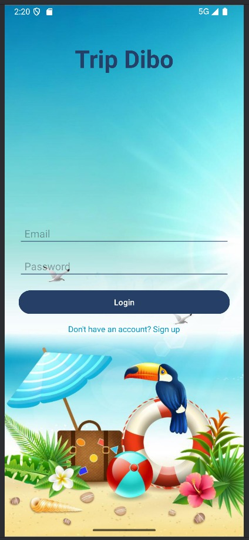
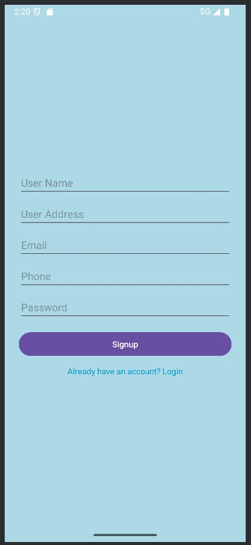
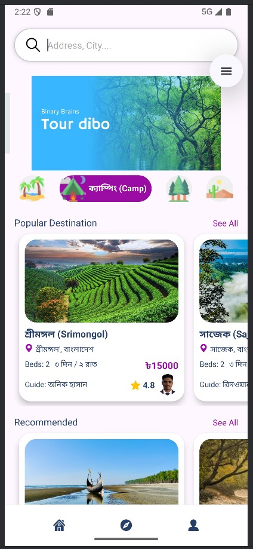
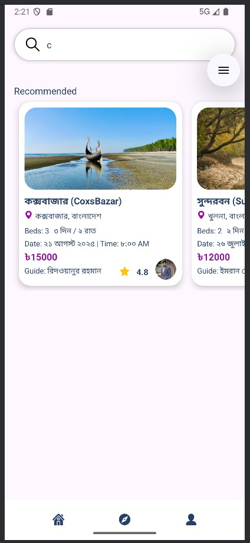
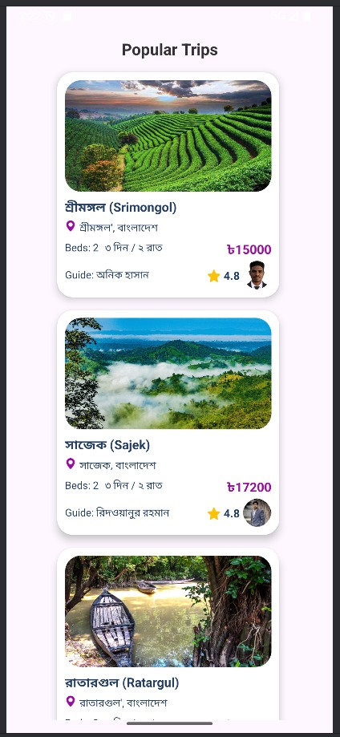
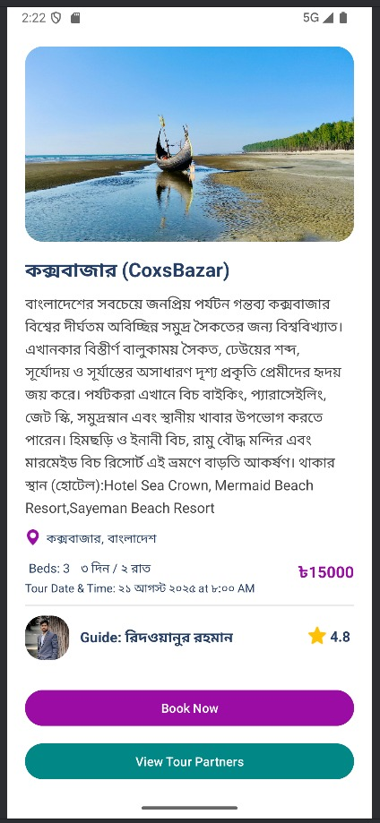
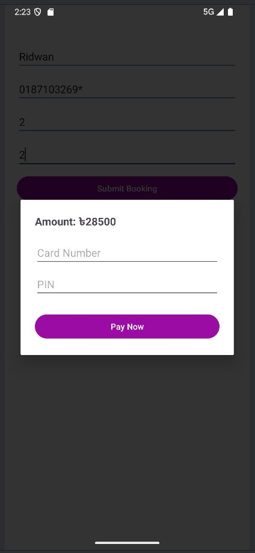
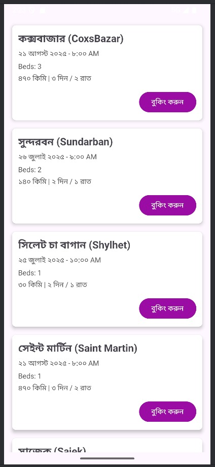

# 🧳 TourApp - Android Travel Booking Application

[](https://developer.android.com)
[](https://www.java.com)
[](https://firebase.google.com)
[](LICENSE)

TourApp is a modern, feature-rich Android application that revolutionizes the way users discover and book travel packages. Built with Java and powered by Firebase, the app provides a seamless experience for travelers to explore destinations, view detailed package information, and complete bookings with ease.

## 📱 Screenshots

| Login Screen | Sign Up Screen | Home Screen | Search Feature |
|:------------:|:--------------:|:-----------:|:--------------:|
|  |  |  |  |

| Popular Trips | Booking Process | Payment Cart | Trip Booking |
|:-------------:|:---------------:|:------------:|:------------:|
|  |  |  |  |

| Trip Listings |
|:-------------:|
|  |

## ✨ Key Features

### 🔐 **Authentication System**
- Secure user registration and login
- Firebase Authentication integration
- Password reset functionality

### 🏠 **Tour Discovery**
- **Real-time Package Updates**: Display the latest and most popular tour packages
- **Advanced Search**: Find packages by destination, price range, or duration
- **Category Filtering**: Browse packages by travel type and preferences
- **Popular Destinations**: Featured trending travel spots

### 🖼️ **Rich Media Experience**
- **Image Sliders**: ViewPager2-powered smooth image galleries
- **High-quality Images**: Glide library for optimized image loading and caching
- **Interactive Gallery**: Swipe through destination photos

### 📋 **Package Management**
- **Detailed Information**: Comprehensive package details including itinerary, pricing, and inclusions
- **Real-time Availability**: Live updates on package availability
- **Price Comparison**: Clear pricing structure with package comparisons

### 🛒 **Booking System**
- **One-click Booking**: Streamlined booking process
- **Cart Management**: Add multiple packages to cart
- **Booking History**: Track previous and current bookings
- **Payment Integration**: Secure payment processing

### 🔄 **Real-time Synchronization**
- Firebase Realtime Database integration
- Instant updates across all user devices
- Offline data caching for better performance

## 🛠️ Technical Architecture

### **Core Technologies**
| Technology | Purpose | Version |
|:-----------|:--------|:--------|
| **Java** | Primary programming language | JDK 8+ |
| **Android Studio** | Development environment | Latest stable |
| **Firebase Realtime Database** | Backend data storage | Latest |
| **Firebase Authentication** | User management | Latest |

### **UI/UX Libraries**
| Library | Purpose | Implementation |
|:--------|:--------|:---------------|
| **ViewPager2** | Image sliders and tabs | Enhanced user navigation |
| **RecyclerView** | Efficient list displays | Optimized scrolling performance |
| **Glide** | Image loading & caching | Memory-efficient image handling |
| **Material Design** | Modern UI components | Consistent design language |

### **Architecture Pattern**
- **MVVM (Model-View-ViewModel)**: Clean separation of concerns
- **Repository Pattern**: Centralized data management
- **Observer Pattern**: Real-time data updates

## 🎯 Target Audience

- **🧳 Frequent Travelers**: Business and leisure travelers seeking convenient booking
- **💻 Remote Workers**: Digital nomads looking for workation packages
- **🎉 Event Organizers**: Corporate and group travel coordinators
- **🎓 Students & Professionals**: Budget-conscious travelers seeking value packages
- **👥 Families**: Multi-generational trip planners

## 🚀 Getting Started

### **Prerequisites**
- Android Studio Arctic Fox or later
- JDK 8 or higher
- Android SDK API level 21+
- Firebase account
- Physical Android device or emulator

### **Installation Steps**

1. **Clone the Repository**
   ```bash
   git clone https://github.com/RidwanSupon/TourApp.git
   cd TourApp
   ```

2. **Open in Android Studio**
   - Launch Android Studio
   - Select "Open an existing Android Studio project"
   - Navigate to the cloned directory and select it

3. **Firebase Configuration**
   - Create a new Firebase project at [Firebase Console](https://console.firebase.google.com)
   - Enable **Authentication** and **Realtime Database**
   - Download `google-services.json`
   - Place the file in the `app/` directory

4. **Firebase Database Setup**
   ```json
   {
     "tour_packages": {
       "package_id": {
         "title": "Package Title",
         "description": "Package Description",
         "price": 999,
         "duration": "5 days",
         "images": ["url1", "url2"],
         "location": "Destination",
         "availability": true
       }
     }
   }
   ```

5. **Build and Run**
   - Sync project with Gradle files
   - Build the project (`Build > Make Project`)
   - Run on emulator or physical device

### **Firebase Security Rules**
```json
{
  "rules": {
    "tour_packages": {
      ".read": "auth != null",
      ".write": "auth != null"
    },
    "bookings": {
      "$uid": {
        ".read": "$uid === auth.uid",
        ".write": "$uid === auth.uid"
      }
    }
  }
}
```

## 📁 Project Structure

```
TourApp/
├── app/
│   ├── src/main/java/com/yourpackage/tourapp/
│   │   ├── activities/          # UI Activities
│   │   ├── adapters/           # RecyclerView Adapters
│   │   ├── fragments/          # UI Fragments
│   │   ├── models/             # Data Models
│   │   ├── repositories/       # Data Repository Classes
│   │   ├── utils/              # Utility Classes
│   │   └── viewmodels/         # ViewModel Classes
│   ├── src/main/res/
│   │   ├── layout/             # XML Layout Files
│   │   ├── drawable/           # Images and Icons
│   │   ├── values/             # Strings, Colors, Styles
│   │   └── menu/               # Menu Resources
│   └── google-services.json    # Firebase Configuration
├── Resources/                  # Screenshot Images
└── README.md
```

## 🔧 Configuration

### **Gradle Dependencies**
Key dependencies in `app/build.gradle`:
```gradle
dependencies {
    implementation 'com.google.firebase:firebase-database:20.3.0'
    implementation 'com.google.firebase:firebase-auth:22.3.0'
    implementation 'com.github.bumptech.glide:glide:4.15.1'
    implementation 'androidx.recyclerview:recyclerview:1.3.2'
    implementation 'androidx.viewpager2:viewpager2:1.0.0'
    implementation 'com.google.android.material:material:1.10.0'
}
```


## 🚀 Deployment

### **Release Build**
1. Generate signed APK in Android Studio
2. Configure ProGuard for code obfuscation
3. Test on multiple devices and API levels
4. Upload to Google Play Console

## 🤝 Contributing

We welcome contributions! Please follow these steps:

1. Fork the repository
2. Create a feature branch (`git checkout -b feature/AmazingFeature`)
3. Commit changes (`git commit -m 'Add AmazingFeature'`)
4. Push to branch (`git push origin feature/AmazingFeature`)
5. Open a Pull Request

## 📄 License

This project is licensed under the MIT License - see the [LICENSE](LICENSE) file for details.

## 👨‍💻 Author

**Ridwan Supon**
- GitHub: [@RidwanSupon](https://github.com/RidwanSupon)
- Email: [your.email@example.com](mailto:your.email@example.com)

## 🙏 Acknowledgments

- Firebase team for excellent backend services
- Material Design team for UI/UX guidelines
- Android development community for continuous support
- Open source contributors

## 📞 Support

If you encounter any issues or have questions:
- Open an issue on GitHub
- Contact the development team
- Check the [Wiki](https://github.com/RidwanSupon/TourApp/wiki) for detailed documentation

---

⭐ **Star this repository if you found it helpful!**
