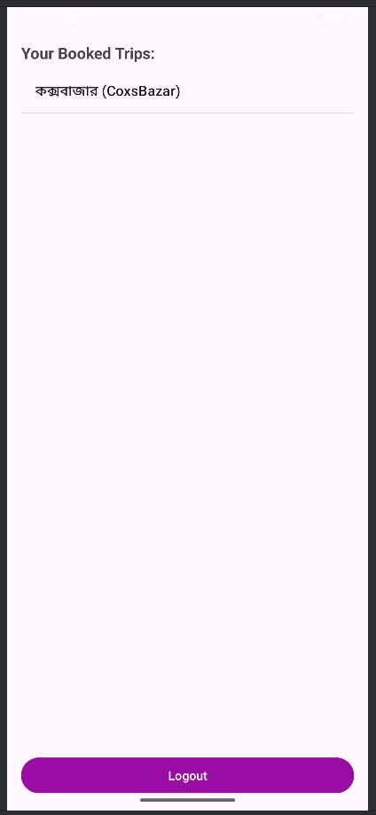

# 🧳 TourApp - Android Travel Booking Application

[](https://developer.android.com)
[](https://www.java.com)
[](https://firebase.google.com)
[](LICENSE)

TourApp is a modern, feature-rich Android application that revolutionizes the way users discover and book travel packages. Built with Java and powered by Firebase, the app provides a seamless experience for travelers to explore destinations, view detailed package information, and complete bookings with ease.

## 📱 Screenshots

| Login Screen | Sign Up Screen | Home Screen | Search Feature |
|:------------:|:--------------:|:-----------:|:--------------:|
|  |  |  |  |

| Popular Trips | Booking Process | Payment Cart | Trip Booking |
|:-------------:|:---------------:|:------------:|:------------:|
|  |  |  |  |

| Trip Listings |
|:-------------:|
|  |

## ✨ Key Features

### 🔐 **Authentication System**
- Secure user registration and login
- Firebase Authentication integration
- Password reset functionality

### 🏠 **Tour Discovery**
- **Real-time Package Updates**: Display the latest and most popular tour packages
- **Advanced Search**: Find packages by destination, price range, or duration
- **Category Filtering**: Browse packages by travel type and preferences
- **Popular Destinations**: Featured trending travel spots

### 🖼️ **Rich Media Experience**
- **Image Sliders**: ViewPager2-powered smooth image galleries
- **High-quality Images**: Glide library for optimized image loading and caching
- **Interactive Gallery**: Swipe through destination photos

### 📋 **Package Management**
- **Detailed Information**: Comprehensive package details including itinerary, pricing, and inclusions
- **Real-time Availability**: Live updates on package availability
- **Price Comparison**: Clear pricing structure with package comparisons

### 🛒 **Booking System**
- **One-click Booking**: Streamlined booking process
- **Cart Management**: Add multiple packages to cart
- **Booking History**: Track previous and current bookings
- **Payment Integration**: Secure payment processing

### 🔄 **Real-time Synchronization**
- Firebase Realtime Database integration
- Instant updates across all user devices
- Offline data caching for better performance

## 🛠️ Technical Architecture

### **Core Technologies**
| Technology | Purpose | Version |
|:-----------|:--------|:--------|
| **Java** | Primary programming language | JDK 8+ |
| **Android Studio** | Development environment | Latest stable |
| **Firebase Realtime Database** | Backend data storage | Latest |
| **Firebase Authentication** | User management | Latest |

### **Architecture Pattern**
- **MVVM (Model-View-ViewModel)**: Clean separation of concerns
- **Repository Pattern**: Centralized data management
- **Observer Pattern**: Real-time data updates

## 🎯 Target Audience

- **🧳 Frequent Travelers**: Business and leisure travelers seeking convenient booking
- **💻 Remote Workers**: Digital nomads looking for workation packages
- **🎉 Event Organizers**: Corporate and group travel coordinators
- **🎓 Students & Professionals**: Budget-conscious travelers seeking value packages
- **👥 Families**: Multi-generational trip planners

## 🚀 Getting Started

### **Prerequisites**
- Android Studio Arctic Fox or later
- JDK 8 or higher
- Android SDK API level 21+
- Firebase account
- Physical Android device or emulator

### **Installation Steps**

1. **Clone the Repository**
   ```bash
   git clone https://github.com/RidwanSupon/TourApp.git
   cd TourApp
   ```

2. **Open in Android Studio**
   - Launch Android Studio
   - Select "Open an existing Android Studio project"
   - Navigate to the cloned directory and select it

3. **Firebase Configuration**
   - Create a new Firebase project at [Firebase Console](https://console.firebase.google.com)
   - Enable **Authentication** and **Realtime Database**
   - Download `google-services.json`
   - Place the file in the `app/` directory


## 🙏 Acknowledgments

- Firebase team for excellent backend services
- Material Design team for UI/UX guidelines
- Android development community for continuous support
- Open source contributors

## 📞 Support

If you encounter any issues or have questions:
- Open an issue on GitHub
- Contact the development team
- Check the [Wiki](https://github.com/Md-EmranHossen) for detailed documentation


⭐ **Star this repository if you found it helpful!**
